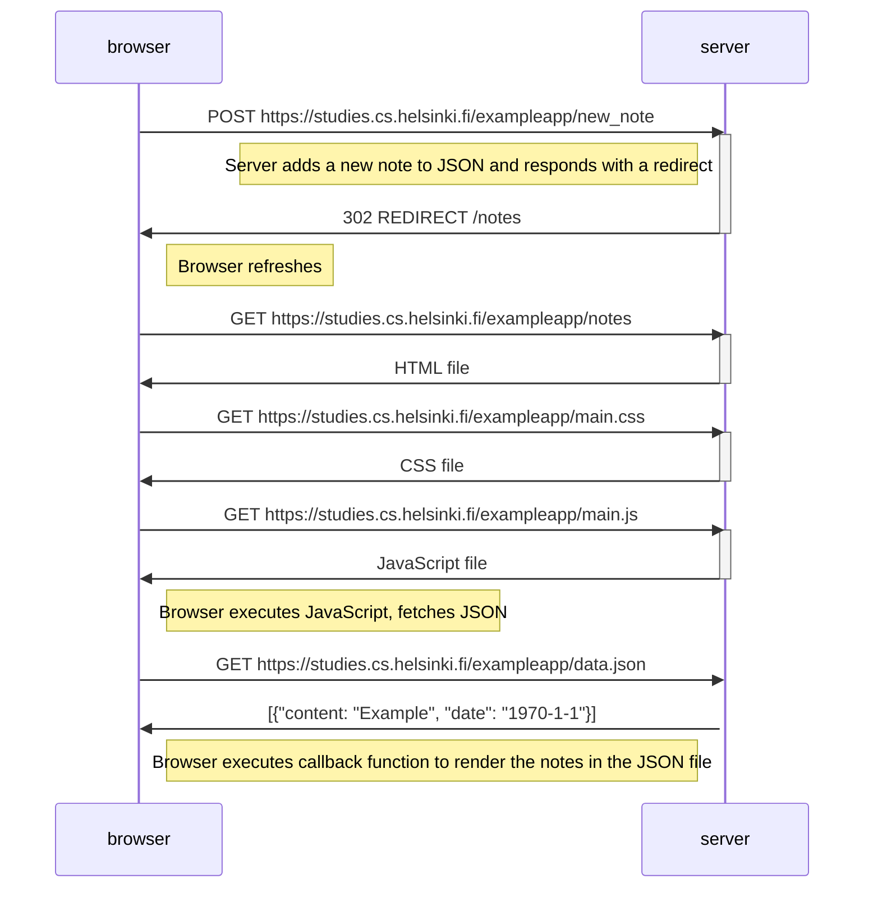

```mermaid
sequenceDiagram
    participant browser
    participant server

    browser->>server: POST https://studies.cs.helsinki.fi/exampleapp/new_note
    activate server

    Note left of server: Server adds a new note to JSON and responds with a redirect
    
    server->>browser: 302 REDIRECT /notes
    deactivate server

    Note right of browser: Browser refreshes

    browser->>server: GET https://studies.cs.helsinki.fi/exampleapp/notes
    activate server
    server->>browser: HTML file
    deactivate server

    browser->>server: GET https://studies.cs.helsinki.fi/exampleapp/main.css
    activate server
    server->>browser: CSS file
    deactivate server

    browser->>server: GET https://studies.cs.helsinki.fi/exampleapp/main.js
    activate server
    server->>browser: JavaScript file
    deactivate server

    Note right of browser: Browser executes JavaScript, fetches JSON

    browser->>server: GET https://studies.cs.helsinki.fi/exampleapp/data.json
    activate server
    server->>browser: [{"content: "Example", "date": "1970-1-1"}]

    Note right of browser: Browser executes callback function to render the notes in the JSON file

```