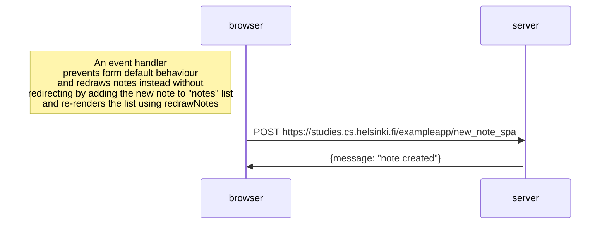

```mermaid
sequenceDiagram
    participant browser
    participant server

    Note left of browser: An event handler<br>prevents form default behaviour<br>and redraws notes instead without<br>redirecting by adding the new note to "notes" list<br> and re-renders the list using redrawNotes

    browser->>server: POST https://studies.cs.helsinki.fi/exampleapp/new_note_spa

    activate server
    server->>browser: {message: "note created"}

```